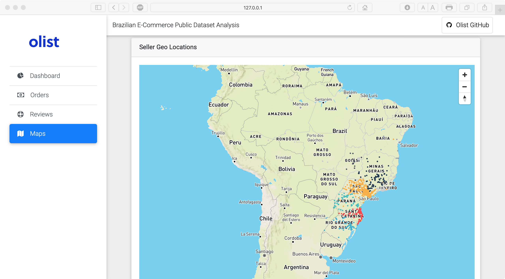

# Olist
A Python implementation of our database project

## Requirements
- [Anaconda](https://www.anaconda.com/download/)

- [MySQL](https://www.mysql.com)

- [Flask](http://flask.pocoo.org)

- [Bootstrap](https://getbootstrap.com)

- [MDB](https://mdbootstrap.com)

- [MapBox](https://www.mapbox.com)

## Dataset
The dataset is sampled from [Olist](http://www.olist.com). Download the dataset from 
[Kaggle](https://www.kaggle.com/olistbr/brazilian-ecommerce), and then extract it into `data` directory. Run
```
python data_clear.py
```
to generate the clean data. You also could download the clean dataset from [BaiduYun](https://pan.baidu.com/s/1TaloiplLcdIzL52Q_tJ4AQ)(access code:tcvm), 
and extract it into `data` directory, then you just needn't run the script above anymore.

## Usage
### View Web
```
python app.py
```
Now you can go to `127.0.0.1:5000/` in your browser, which shows a lot of figures about the data. 

## Web Pages
### DashBoard


### Orders


### Reviews


### Maps





## Copyright and License
This project is provided under the [MIT License](LICENSE).
